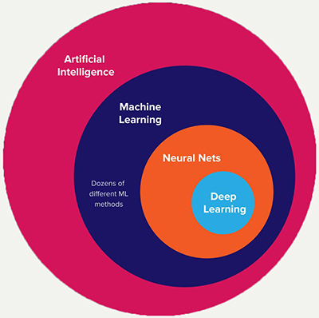
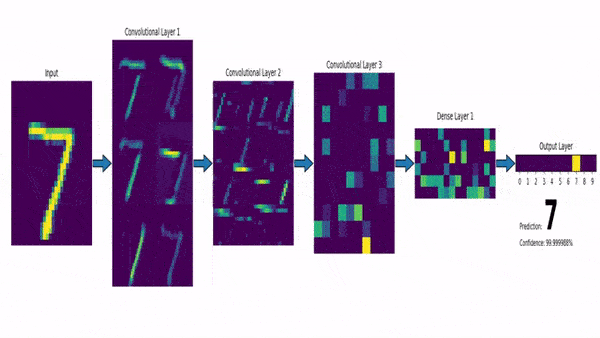
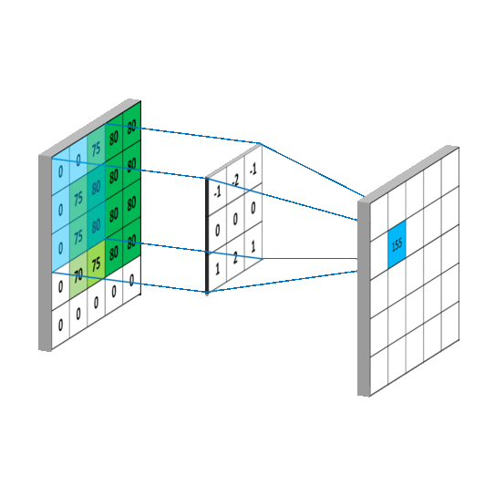
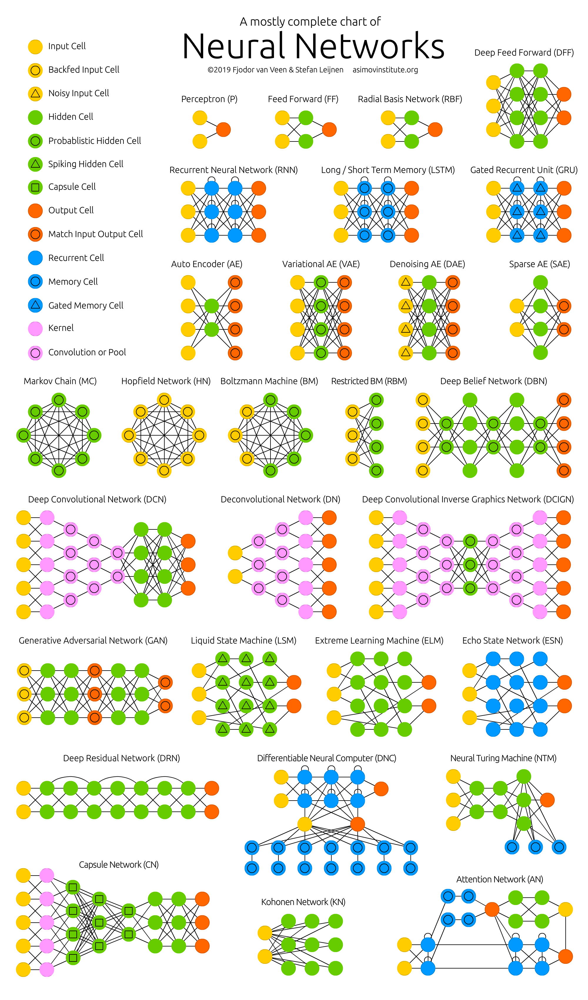

<style type="text/css">
.remark-slide-content {
    font-size: 27px;
    padding: 1em 4em 1em 2em;
}</style>
```{r setup, include=FALSE}
options(htmltools.dir.version = FALSE)
knitr::opts_chunk$set(
  fig.align="center",
  fig.width=13, 
  fig.height=5,
  fig.pos = 'H',
  fig.retina = 3,
  echo = TRUE,
  message = FALSE,
  warning = FALSE,
  cache = TRUE,
  dev.args = list(pointsize = 11)
)

library(tidyverse)
library(vroom)
library(kableExtra)
library(knitr)

xaringanExtra::use_freezeframe()
xaringanExtra::use_panelset()
xaringanExtra::use_scribble()
xaringanExtra::use_search(show_icon = TRUE)
xaringanExtra::use_extra_styles(
  hover_code_line = TRUE,         #<<
  mute_unhighlighted_code = TRUE  #<<
)
```

# Що таке ML?
**Машинне навчання** - це розділ інформатики, який присвячений створенню алгоритмів для досягнення певних цілей на підґрунті набору даних про досліджуваний об'єкт.

.pull-left[
**Три складові ML:**
* данні
* ознаки (features)
* алгоритм
]
.pull-right[
```{r venn, echo=FALSE}
include_graphics("img/venn.jpg")
```
]

---

# Навчання vs. Інтелект
.pull-left[
* **Штучний інтелект** - загальна назва сфери.

* **Машинне навчання** - розділ штучного інтелекту.

* **Нейромережі** - вид з видів машинного навчання.

* **Глибоке навчання** - архітектура нейромереж, підхід до побудови.
]
.pull-right[
```{r ai_vs_ml, echo=FALSE, out.width=600}

```
]

---

# Мапа машинного навчання
```{r ml_map, echo=FALSE, out.width=800}
include_graphics("img/ml_map.png")
```

---

# Види машинного навчання
* **Класичне навчання:** прості дані, зрозумілі ознаки
* **Навчання з підкріпленням:** даних не має, але є оточення з котрим можна взаємодіяти
* **Ансамблі:** коли треба краще!
* **Нейромережі та глибоке навчання:** складі данні, незрозумілі ознаки, магія!

---

# 1. Класичне навчання
* **З вчителем (supervised learning)**
  * класифікація
  * регресія
* **Без вчителя (unsupervised learning)**
  * кластеризація
  * зменшення розмірності
  * асоціації
* **Напівконтрольне навчання (semi-supervised learning)**

---

# З вчителем (supervised learning)

**Що в нас є:**
1. Розмічені дані
2. Вектор ознак.

> На основі даних, побудувати модель, яка приймає значення (`x`) на вході і повертає інформацію, яка дозволяє визначити мітку для цього вектора показників (`y`).

* Регресія: визначаємо число
* Класифікація: визначаємо клас

---

# Регресія
.pull-left[
## Приклади використання:
* прогноз вартості цінних бумаг
* аналіз попиту, об'єм продажів
* часові ряди у всіх проявах
* ...
]
.pull-right[
## Популярні алгоритми:
* Лінійна регресія
* Поліноміальна регресія
* Рідж/Лассо регресія
* Квантильна регресія
* ...
]

---

# Класифікація
.pull-left[
## Приклади використання:
* спам-фільтри
* визначення мови
* пошук подібних документів
* аналіз тональності
* розпізнавання рукописного тексту
* визначення підозрілих транзакцій
* ...
]
.pull-right[
## Популярні алгоритми:
* Наївний байєсовський класифікатор
* Дерева прийняття рішень (CART, C4.5)
* Логістична регресія
* К-ближчих сусідів
* Метод опорних векторів
* ...
]

---

# Без вчителя (unsupervised learning)

**Що в нас є:**
1. Нерозмічені дані.
2. Вектор ознак.

> На основі даних побудувати модель, яка приймає значення (`x`) та перетворює його в інший вектор або значення, яке дозволяє вирішити задачу.

* Кластеризація: ідентифікація кластеру
* Зменшення розмірності: повертається вектор меншої розмірності
* Виявлення аномалій: визначаємо які значення `x` відрізняється від "типових" даних

---

# Кластеризація
.pull-left[
## Приклади використання:
* сегментація ринку
* об'єднання близьких точок на карті
* стиснення зображень
* аналіз та розмітки нових даних
* детектори аномальної поведінки
* ...
]
.pull-right[
## Популярні алгоритми:
* Метод К-середніх
* Mean-Shift
* DBSCAN
* ...
]

---

background-image: url("img/kmeans.gif")

# Метод К-середніх

---

background-image: url("img/dbscan.gif")

# DBSCAN

---

# Зменшення розмірності
.pull-left[
## Приклади використання:
* рекомендовані системи
* візуалізація
* визначення тематики та пошуку схожих документів
* аналіз фейкових зображень
* ризик-менеджмент
* ...
]
.pull-right[
## Популярні алгоритми:
* Метод головних компонентів (PCA)
* Сингулярне розкладання (SVD)
* Латентне розміщення Діріхле (LDA)
* Латентно-семантичний аналіз (LSA, pLSA, GLSA)
* t-SNE (для візуалізації)
* ...
]

---

background-image: url("img/pca.gif")

# Метод головних компонентів (PCA)

---

background-image: url("img/lsa.gif")
# Сингулярне розкладання (SVD)

---

# Асоціативні правила
.pull-left[
## Приклади використання:
* прогноз акцій та розпродажів
* аналіз товарів, які купують разом
* розміщення товарів на поличках
* аналіз поведінки на сайті
* ...
]
.pull-right[
## Популярні алгоритми:
* Apriori
* Euclat
* FP-growth
* ...
]

---

# Напівконтрольне навчання (semi-supervised)

**Що в нас є:**
1. Частково розмічені дані.
2. Вектор ознак.

> На основі даних, побудувати модель, яка приймає значення (`x`) на вході і повертає інформацію, яка дозволяє визначити мітку для нерозмічених даних.

---

background-image: url("img/semi-supervised.gif")
# Напівконтрольне навчання (semi-supervised)


---

# 2. Навчання з підкріпленням (reinforcement)
.pull-left[
## Застосування:
* Самокеровані автомобілі
* Роботи пилососи
* Ігри
* Автоматична торгівля
* Управління ресурсами підприємства
* ...
]
.pull-right[
## Популярні алгоритми:
* Q-Learning 
* SARSA
* DQN, 
* A3C, 
* Генетичний алгоритм
* ...
]

---

# 3. Ансамблі
.pull-left[
## Застосування:
* Там де й класичні підходи, але працюють краще
* Пошукові системи
* Комп'ютерний зір
* Розпізнавання об'єктів
* ...

## Популярні алгоритми:
* Випадковий ліс
* Градіентний бустінг
* ...
]
.pull-right[
## Варіанти побудови:
* Стекінг
* Беггінг
* Бустінг
]

---

background-image: url("img/stacking.png")
# Стекінг

Результати різних алгоритмів передаються результуючому, який приймає рішення

---

background-image: url("img/bagging.png")
# Беггінг (**B**ootstrap **AGG**regat**ING**)

---

background-image: url("img/Boosting.svg")
# Бустінг

---

# 4. Нейронні мережі і глибоке навчання
.pull-left[
## Застосування:
* Всі задачі, що були перечислені до цього
* Переклад
* Обробка фото та відео
* Розпізнавання та синтез мови
* Визначення об'єктів на фото та відео
* ...
]
.pull-right[
## Популярні алгоритми:
* Перцептрон
* Згорткові (CNN)
* Рекурентні (RNN)
* Автоенкодери
* ...
]

---

background-image: url("img/nural.gif")
background-size: contain

# Перцептрон

---

background-image: url("img/mlp.gif")

# Багатошаровий перцептрон (MLP)

---

background-image: url("img/cnn.gif")

# Згорткові нейромережі (CNN)

---

# Згорткові нейромережі (CNN)
.pull-left[
```{r cnn3.gif, echo=FALSE}

```
]
.pull-right[
```{r cnn2.gif, echo=FALSE}

```
]

---

# Зоопарк архітектур нейромереж
[THE NEURAL NETWORK ZOO](https://www.asimovinstitute.org/neural-network-zoo/)
```{r zoo, echo=FALSE}

```
